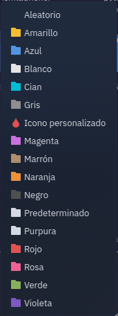
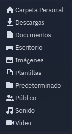

Dolphin Folder Color
====================
version 3.0.0-Mefsaal

A KDE Service Menu for coloring the folders so fast, also has the ability to color a selected set of folders.
Plasma 6 Only

## Installation
You just need to run the script. **install.sh** in konsole and restart dolphin.

## Compatible Themes :
 [Papirus icon theme](https://github.com/PapirusDevelopmentTeam/papirus-icon-theme)

## Screenshots
### Service Menu
 
 
### Custom Icon Color
 
                                    
### Custom Icon Symbolic
 